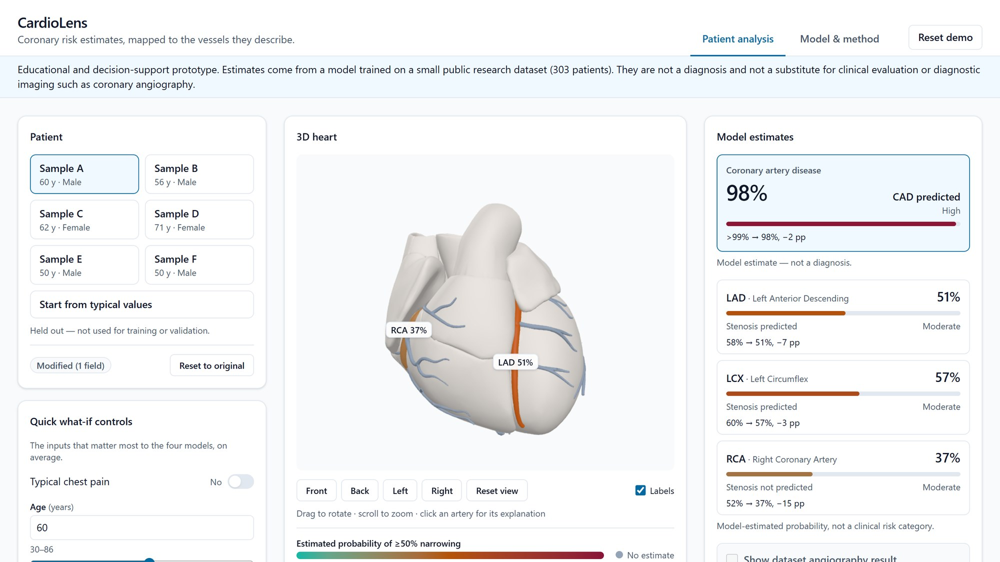
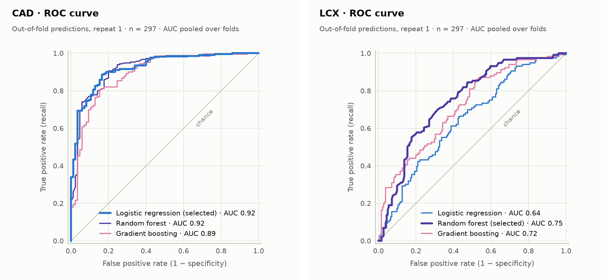
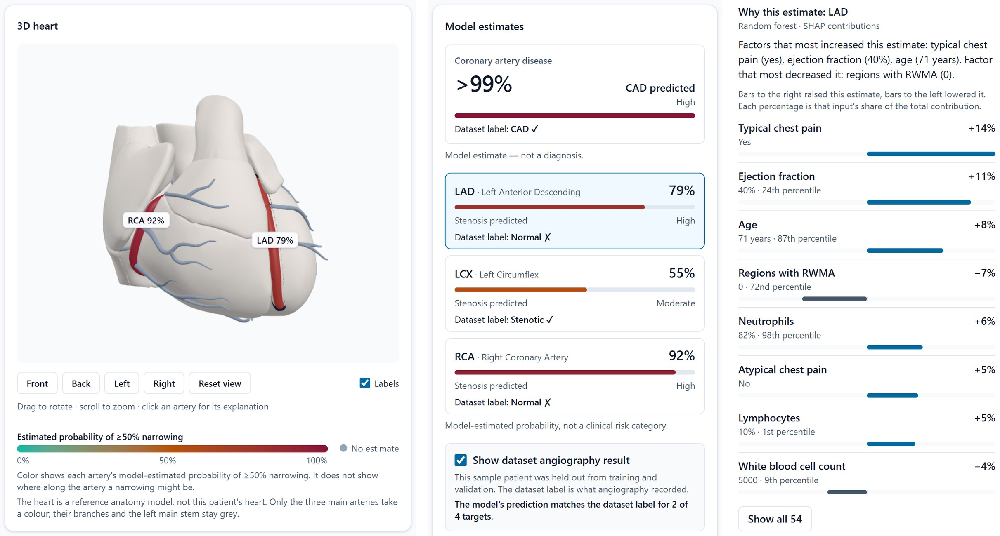

# CardioLens: coronary risk estimates, mapped to the vessels they describe

**Project report** · Multimodal AI Hackathon 2026, Track A: Cardiovascular Risk Visualization & Prediction · Satvik Chauhan · October 2026 · Code: https://github.com/satvikchauhan01/CardioLens

> Educational and decision-support prototype. Estimates come from a model trained on a small public research dataset (303 patients). They are not a diagnosis and not a substitute for clinical evaluation or diagnostic imaging such as coronary angiography.

## 1. Overview and problem

Coronary artery disease (CAD) is a narrowing of the arteries that supply the heart muscle. In this track's dataset a patient, or a single artery, counts as diseased when angiography shows a narrowing of 50% or more. A single risk number does not say which artery a model is concerned about, or why. CardioLens answers three questions for one patient record: how likely are CAD overall and a ≥50% narrowing in each of the three main arteries (LAD, LCX, RCA); where on the heart do these estimates belong; and which of the patient's measurements produced each estimate.

It is a web application whose parts work as one (Figure 1): a form built from the dataset's 54 clinical inputs, with six held-out sample patients; four separate models served by an API; an interactive 3D heart whose coronary arteries take the colour of their estimated probability; a per-target explanation with the patient's values and their relative contributions; a what-if mode that shows how each estimate moves when an input changes; and an evaluation page with the cross-validated metrics, plots and limitations.

<!-- width: 100% -->


*Figure 1. The application with Sample A. "Typical chest pain" has been switched off in the quick controls: each estimate shows its change against the loaded patient (RCA 52% → 37%), the RCA has changed colour on the heart, and the input panel says how many fields are modified.*

## 2. Dataset and preprocessing

**Data.** The UCI "extention of Z-Alizadeh sani dataset" [1]: 303 patients, 59 columns, no missing values and no duplicate rows (checked by `python -m ml.inspect_data`, which writes a report computed only from the file). Four columns are angiography labels: `Cath` (CAD / Normal) and `LAD`, `LCX`, `RCA` (Stenotic / Normal). The other 55 are inputs.

| Target | Positive | Negative | Prevalence |
|---|---|---|---|
| CAD (`Cath`) | 216 | 87 | 71.3% |
| LAD | 177 | 126 | 58.4% |
| LCX | 119 | 184 | 39.3% |
| RCA | 114 | 189 | 37.6% |

`Cath` equals "at least one vessel stenotic" in 302 of the 303 rows; the one inconsistent row is kept exactly as recorded. Labels are never modified.

**Inputs.** 54 of the 55 input columns are used: 17 on demographics and history, 13 on symptoms and examination, 7 ECG findings, 14 laboratory values and 3 echocardiography findings. `Exertional CP` has the same value in every row and is dropped. By type there are 23 numeric, 28 yes/no, 2 categorical and 1 ordinal input. They are recorded findings (for example "ST depression: yes"), not raw ECG signals or images. Raw spellings are mapped to one canonical form (`Y`/`N` and `1`/`0` to yes/no, `Fmale` to Female); a value without a mapping stops the pipeline. Units come from two papers by the dataset's creators [2, 3]; where they do not fit the values (white blood cells, platelets) no unit is shown.

**Held-out patients.** Before any training, six patients are set aside by a fixed, seeded rule (one with three stenotic vessels, one with two, two with one, two with none). They are never used for training or validation and serve as the app's sample patients. The remaining 297 patients are the training rows.

**Preprocessing** is part of each model's pipeline and is therefore refitted inside every cross-validation fold: numeric inputs are standardised, yes/no inputs pass through, the ordinal input is encoded in its order, and categorical inputs are one-hot encoded (57 model columns from 54 inputs).

## 3. Models, validation and leakage guard

**Four models.** One binary classifier per target (`cad`, `lad`, `lcx`, `rca`), all on the same 54 inputs. For each target three candidates are compared with library defaults and fixed seeds: logistic regression, a random forest of 300 trees and gradient boosting, plus a baseline that always predicts the class prior. Nothing is tuned: with 297 rows a hyperparameter search would mostly fit noise.

**Leakage guard.** The four label columns are closely related: CAD is present when a vessel is stenotic. So `LAD`, `LCX`, `RCA` and `Cath` are never inputs to any model. The guard is in the data loader, the preprocessor, the trainer (training stops before anything is written) and the API's start-up check, and automated tests cover each place.

**Validation.** Repeated stratified 5-fold cross-validation with 5 repeats (25 folds, seed 42) on the 297 training rows. Per fold we record accuracy, precision, recall, specificity, F1, ROC-AUC, average precision and the Brier score, and report the mean ± standard deviation over the folds, at the decision threshold of 0.5. The candidate with the highest mean ROC-AUC is selected; logistic regression is preferred when it is within 0.01 of the best. The selected candidate is then refitted on all 297 rows and saved. Model selection and the reported metrics use the same folds (no nested cross-validation), so the numbers of the selected models are slightly optimistic; with three untuned candidates per target the effect is small, but it is not zero.

**Reproducibility.** `python -m ml.train` runs everything in about a minute on a laptop CPU and writes the models, metrics, plots, input schema and sample patients. Seeds and library versions are fixed: a rerun reproduces every metric and every predicted probability. The test suite trains once more into a temporary folder and serves the result through the API.

## 4. Results

All numbers below are copied from `backend/artifacts/metrics.json` (model version `20261007T1423Z-7393432`).

| Target | Selected model | ROC-AUC | Accuracy | Precision | Recall | Specificity | F1 | Brier |
|---|---|---|---|---|---|---|---|---|
| CAD | Logistic regression | 0.917 ± 0.033 | 0.860 ± 0.031 | 0.908 ± 0.034 | 0.896 ± 0.044 | 0.769 ± 0.096 | 0.901 ± 0.023 | 0.104 ± 0.019 |
| LAD | Random forest | 0.855 ± 0.053 | 0.789 ± 0.064 | 0.784 ± 0.064 | 0.892 ± 0.051 | 0.643 ± 0.130 | 0.833 ± 0.048 | 0.161 ± 0.019 |
| LCX | Random forest | 0.739 ± 0.056 | 0.675 ± 0.046 | 0.653 ± 0.116 | 0.396 ± 0.088 | 0.854 ± 0.075 | 0.485 ± 0.076 | 0.204 ± 0.011 |
| RCA | Logistic regression | 0.725 ± 0.045 | 0.672 ± 0.049 | 0.581 ± 0.076 | 0.526 ± 0.093 | 0.762 ± 0.071 | 0.547 ± 0.070 | 0.215 ± 0.026 |

ROC-AUC of every candidate (mean ± std over 25 folds); the baseline scores 0.500 on every target:

| Target | Logistic regression | Random forest | Gradient boosting |
|---|---|---|---|
| CAD | **0.917 ± 0.033** | 0.922 ± 0.036 | 0.904 ± 0.040 |
| LAD | 0.835 ± 0.053 | **0.855 ± 0.053** | 0.836 ± 0.059 |
| LCX | 0.670 ± 0.051 | **0.739 ± 0.056** | 0.732 ± 0.061 |
| RCA | **0.725 ± 0.045** | 0.700 ± 0.044 | 0.651 ± 0.060 |

**Reading the numbers.** The overall CAD model separates patients well. The vessel models are clearly weaker, and weakest for LCX and RCA: at the 0.5 threshold they find only 40% and 53% of the stenotic vessels. The same routine findings say much more about whether a patient has CAD than about which artery is affected. The standard deviations are wide because each fold tests about 59 patients. The reliability plots (five bins of out-of-fold predictions) follow the diagonal closely for CAD. The two random forests pull their probabilities towards the middle (LAD: 0.28 predicted against 0.13 observed in the lowest bin, 0.83 against 0.92 in the highest), and the RCA model is over-confident at the top (0.81 predicted against 0.63 observed). No calibration step or threshold change was applied. The app therefore shows probabilities with their level, never a bare verdict, and its evaluation page shows every candidate, the baseline and all plots.

<!-- width: 80% -->


*Figure 2. Out-of-fold ROC curves of the three candidates for CAD (left) and LCX (right), first repeat. The same plots, with calibration and confusion matrices for all four targets, are on the app's Model & method tab.*

**Held-out patients.** For the six sample patients the models' 24 predictions match the dataset labels in 21 cases: all four targets for four patients, three of four for one (CAD predicted, label Normal) and two of four for one (Figure 3). Six patients are an illustration, not an evaluation; the app shows the misses as plainly as the hits.

**What the models rely on.** By share of the mean absolute SHAP value on the training rows, the leading inputs are regional wall motion abnormality, typical chest pain and age for CAD; typical chest pain, regional wall motion abnormality and ejection fraction for LAD; age, typical chest pain and creatinine for LCX; and diabetes, sex and age for RCA.

## 5. Interpretability

Each prediction comes with one explanation per target, computed with SHAP [4] by exact explainers: the linear explainer for logistic regression (in log-odds, with all training rows as background) and the tree explainer for the forest and the boosted trees. Tests check that the contributions add up to the model's output for each model type. Contributions of one-hot columns are summed back to their clinical input, so the user sees 54 inputs, not 57 columns.

For the selected target the panel lists the inputs by size of contribution (Figure 3, right): the patient's value with its unit, where that value lies among the training patients (percentile), the direction, and the input's share of the total contribution. A short summary names the factors that most raised and most lowered the estimate; it is filled from a fixed template, and no generative model is involved. The eight largest contributions are shown and the rest can be expanded.

**What-if.** The eight inputs with the highest average importance across the four models are offered as quick controls. A change is validated, sent after a short pause, and answered in about 0.1 s; estimates, artery colours and explanations update together, and each estimate shows "before → after" with the difference in percentage points. The app states that this shows the model's sensitivity, not the effect of any treatment.

<!-- width: 100% -->


*Figure 3. Held-out Sample D. Left: the heart with the LAD selected. Middle: the estimates with the dataset's angiography labels switched on; the model is wrong for the LAD and the RCA and the app marks both. Right: the explanation of the LAD estimate, with each input's value, percentile and share.*

## 6. 3D pipeline

**Anatomy.** The heart is built from BodyParts3D anatomy parts: 113 files, one anatomical structure each, named with its FMA identifier. A build script selects 44 of them (the chamber walls, the auricles, the roots of the aorta and the pulmonary trunk, and the coronary arteries), places them in the viewer's axes at life proportions, and writes one compressed file of 0.65 MB with about 92,000 triangles. A rebuild from the same parts reproduces the file byte for byte.

**Arteries.** The arteries are the model's own meshes, not drawings. The object named `artery-lad` is exactly the structure "trunk of anterior interventricular branch of left coronary artery" (FMA74912), `artery-lcx` the trunk of the circumflex branch (FMA74923) and `artery-rca` the trunk of the right coronary artery (FMA3802). Only these three trunks take a risk colour. The left main stem and twelve branches are drawn in the legend's "no estimate" grey, because the dataset labels the three vessels and says nothing about their branches.

**One id per target.** The ids `cad`, `lad`, `lcx`, `rca` run unchanged through the training code, the artifact files, the API and the 3D object names. Tests load the shipped model file and check that it holds one mesh per vessel, that each mesh lies along its traced centre line, and that it is built from the trunk of that artery only. This is what keeps a model's output on the right artery.

**Colour.** One function colours the arteries, the legend and the result bars: teal at 0%, amber at 50%, crimson at 100%, interpolated so that the colour also gets steadily darker. The scale therefore reads without telling red from green, and every colour is accompanied by its percentage and level. The legend says what the colour means and what it does not: it is the estimated probability for that artery, not the place of a narrowing.

**Interaction.** Rotate, zoom, hover for a tooltip, click an artery to open its explanation, click the heart for the overall CAD estimate. The list of vessels mirrors every 3D action for keyboard users, and choosing a vessel there turns the heart to a view that shows it. Labels are placed where an artery can actually be seen and hide when the heart covers it; the circumflex trunk, for instance, appears only from the back.

**Performance and fallbacks.** Frames are drawn only when something changes, the pixel ratio is capped, and there are three lights and no shadows or textures. Picking uses bounding-volume trees. If the model file cannot be used, a simpler stand-in heart is drawn; without 3D graphics the app shows a 2D schematic with the same colours and the same selection.

## 7. Architecture and usage

```text
Browser (React, three.js)  --  /api  -->  FastAPI service  -->  4 scikit-learn pipelines + SHAP explainers
```

The service loads the artifacts once and offers five endpoints: health, metadata (targets, input schema, risk levels), sample patients, metrics, and `POST /api/predict`, which returns the four probabilities, their status and level, a note when the overall and the vessel models disagree, and the four explanations. The browser builds its form from the schema, validates each value against the range seen in the dataset before sending, and the service validates again. Inputs are not stored or logged, and the app calls no outside service at run time.

| Measured on a Ryzen 7 5800HS laptop, integrated graphics | Result | Target |
|---|---|---|
| One prediction with four explanations, from the browser | median 80 ms, p95 85 ms | under 300 ms |
| First estimates on screen after opening the page | about 0.13 s | under 3 s |
| Drawing one frame while the heart turns | median 1.1 ms, slowest 5.6 ms | 16.7 ms (60 FPS) |
| 3D scene | 6 draw calls, about 92,000 triangles | under 50 and 150,000 |

**Running it.** Python 3.13 and Node.js 22 are needed. Install with `pip install -r requirements.txt -r requirements-dev.txt` in `backend` and `npm install` in `frontend`; start `uvicorn app.main:app --port 8000` and `npm run dev`; open http://localhost:5173. The trained models and the heart model are in the repository, so nothing has to be trained first. The README gives the full steps for Windows and for macOS / Linux, the troubleshooting notes, and how to retrain. The project has 219 backend and 251 frontend tests.

## 8. Limitations and disclaimer

- Trained on 303 patients from one public research dataset; performance on other populations is unknown.
- Inputs are recorded clinical findings, not raw ECG, echo or imaging data.
- Vessel predictions are per artery; the dataset contains no location of narrowing within an artery.
- Cross-validated metrics have wide uncertainty at this sample size (shown as ± std), and the vessel models, LCX and RCA above all, are modest.
- What-if changes show model sensitivity, not the effect of any treatment.
- The 3D heart is a reference anatomy, the same for every patient. It shows where each artery lies, not this patient's heart.

CardioLens is a prototype for education and decision support. It has not been validated for clinical use, and it is not a substitute for clinical evaluation or for diagnostic imaging such as coronary angiography.

## 9. References and attributions

1. Alizadehsani, R., Roshanzamir, M., & Sani, Z. (2013). *extention of Z-Alizadeh sani dataset* [Dataset]. UCI Machine Learning Repository. https://doi.org/10.24432/C5461K. Licensed under CC BY 4.0.
2. Alizadehsani, R. et al. (2013). Diagnosing Coronary Artery Disease via Data Mining Algorithms by Considering Laboratory and Echocardiography Features. *Res Cardiovasc Med* 2(3):133–139. doi:10.5812/cardiovascmed.10888.
3. Joloudari, J. H. et al. GSVMA: A Genetic-Support Vector Machine-Anova method for CAD diagnosis based on Z-Alizadeh Sani dataset. arXiv:2108.08292.
4. Lundberg, S. M., & Lee, S.-I. (2017). A Unified Approach to Interpreting Model Predictions. *Advances in Neural Information Processing Systems 30*.

**3D anatomy.** BodyParts3D anatomy parts, one file per structure, named with FMA identifiers. The full credit, source address and licence of this model are still to be added here and in the app.

**Software.** scikit-learn, SHAP, pandas, NumPy, FastAPI and Uvicorn; React, Vite, Tailwind CSS, three.js, React Three Fiber and drei; glTF-Transform for compressing the heart model.
